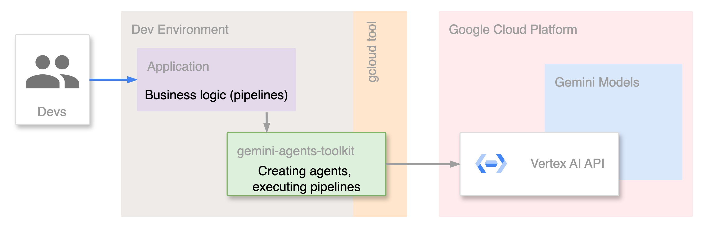

# gemini-agents-toolkit

The project is an SDK for implementing Agent-Driven Development (ADD) applications. 
ADD is aimed to move routine code tasks to the LLM agents and concentrate on the algorithmic and fun part of the business logic implementation.

<h4 align="center">
  <a href="https://opensource.org/licenses/mit">
    
  </a>
  <a href="https://discord.gg/qPWcJhgAx4">
    
  </a>
  <a href="https://www.youtube.com/watch?v=Y4QW_ILmcn8">
    
  </a>
</h4>

⭐ Add a star for a duck!

---

<p align="center">
  <a href="#how-it-works">How It Works</a> &nbsp;&bull;&nbsp;
  <a href="#requirements">Requirements</a> &nbsp;&bull;&nbsp;
  <a href="#getting-started">Getting Started</a> &nbsp;&bull;&nbsp;
  <a href="#run-examples">Run Examples</a> &nbsp;&bull;&nbsp;
  <a href="#how-to-contribute">How To Contribute</a>
</p>

---
## 🚀How It Works

`gemini-agents-toolkit` is an SDK that creates LLM agents and enables their integration into pipelines for modifying generated responses. 

See the picture describing the process:



The roles of every component are as follows:
1. **Application:** Define custom functions to guide LLM executions, launch agents for task execution, and combine tasks into pipelines.
2. `gemini-agents-toolkit`: A tool for creating agents, executing pipelines and interacting with Gemini.
3. **Vertex AI API:** A Google API for interacting with Gemini models.
4. **Gemini:** LLM models that generate text, code, or instructions to guide agent execution.

---
## 📝Requirements

**❗️ The project uses Vertex AI API to access Gemini models, which is paid Google API ❗**

You can find pricing [here](https://cloud.google.com/vertex-ai/generative-ai/pricing).

Agents request text generating only, which is paid for Text Input and Text Output. Running a pipeline will produce several requests depending on the pipeline's complexity.

========

**Supported Python versions:** Python 3.8 to 3.12 (gcloud requirement)

---
## 🤖Getting Started

### Big Picture

This project uses Gemini via Google Cloud API. To use the project you must first set up the following:
- Google Cloud account with Billing
- Allow requesting LLM models via APIs ([pricing](https://cloud.google.com/vertex-ai/generative-ai/pricing))
- Set up gcloud tool in your environment
- Set up the project

### Google Cloud account with Billing
1. Go to [Google AI Studio](https://aistudio.google.com/), select "Get API key" in the menu on the left. Click "Create API" key button and select Google Cloud project to associate API key with. 
2. Click suggestion to "Set up Billing" near your new API key and initialize your Google Billing account.
3. [Optional] You can add a Budget for your account, which will email you when your spendings reach configured thresholds. Choose "Budgets & alerts" in the menu on the left in Billing console and follow the [instruction](https://cloud.google.com/billing/docs/how-to/budgets#steps-to-create-budget).
4. After this step, you should be able to test your Google Cloud project set up running `curl` command presented under the API keys table.

### Allow requesting LLM models via APIs
1. The project uses [Vertex AI API](https://cloud.google.com/vertex-ai/) to request Gemini models, Vertex AI API should be allowed in your Google cloud account. You need to allow it from the [Google Cloud Vertex AI API product page](https://console.cloud.google.com/apis/library/aiplatform.googleapis.com).
2. [Optional] With these [instructions](https://cloud.google.com/apis/docs/capping-api-usage) you can limit or increase your API requests quota.

### Set up gcloud tool in your environment
Follow the Google instructions to [install](https://cloud.google.com/sdk/docs/install) gcloud and to [initialize](https://cloud.google.com/sdk/docs/initializing) it.

### Set up the project
1. Clone `gemini-agents-toolkit` repository.
2. For the development process, you probably will need other repositories from the project. You can find other packages [here](https://github.com/GeminiAgentsToolkit). Currently, the project uses this list of other repositories:

| Module     | Description                           | Link |
|------------|---------------------------------------| --- |
| json-agent | Agent to convert data formats to JSON | [link](https://github.com/GeminiAgentsToolkit/json-agent) |

6. `gemini-agents-toolkit` uses several environment variables that you need to set up:

| Env Variable | Description                                                                                               | Which Value To Set                                                                                                                                    | Command To Set Up                           |
| --- |-----------------------------------------------------------------------------------------------------------|-------------------------------------------------------------------------------------------------------------------------------------------------------|---------------------------------------------|
| GOOGLE_PROJECT | Project id from Google AI Studio                                                                | Open [Google AI studio](https://aistudio.google.com/app/apikey) and choose from the table with projects                                               | `EXPORT  GOOGLE_PROJECT=my-amazing-project` |
| GOOGLE_API_KEY | API key from Google AI Studio to request your project                                                     | Find out the API key in the row with your project                                                                                                     | `EXPORT  GOOGLE_API_KEY=my-amazing-project` |
| GOOGLE_REGION | You can choose which region API to request | You can ignore env for the default value `us-west1`, or find all available regions in Google Cloud [docs](https://cloud.google.com/compute/docs/regions-zones/) | `EXPORT GOOGLE_REGION=my-amazing-project`   |

4. Now, you need to register custom Python modules to use them in examples:
```bash
export PYTHONPATH=/my/custom/module/path:$PYTHONPATH
```
Modules you need to register:

| Module     | Description                           | Link |
|------------|---------------------------------------| --- |
| config     | Using env variables and constants     | [link](https://github.com/GeminiAgentsToolkit/gemini-agents-toolkit/tree/main/config) |
| json-agent | Agent to convert data formats to JSON | [link](https://github.com/GeminiAgentsToolkit/json-agent) |

❗ To have your variables set up permanently, register them in `.bashrc` (`.zshrc` etc, depending on your operational system and shell).

---

## 🎉Run Examples

Now it's time for fun!

Run `examples/simple_example.py` with 
```bash
python examples/simple_example.py
```
In this example, you have created a custom function and gave Gemini ability to use your function:

<details>
<summary>See code</summary>

```python
import vertexai
from config import (PROJECT_ID, REGION, SIMPLE_MODEL)
from gemini_agents_toolkit import agent


def say_to_duck(say: str):
    """say something to a duck"""
    return f"duck answer is: duck duck {say} duck duck duck"


vertexai.init(project=PROJECT_ID, location=REGION)

all_functions = [say_to_duck]
duck_comms_agent = agent.create_agent_from_functions_list(functions=all_functions,
                                                          model_name=SIMPLE_MODEL)

print(duck_comms_agent.send_message("say to the duck message: I am hungry"))
```
</details>

=>>>><<<<=

You can create several agents, which will delegate functions execution to each other:
```bash
python examples/multi_agent_example.py
```

<details>
<summary>See code</summary>

```python
import datetime
import vertexai
from config import (PROJECT_ID, REGION, SIMPLE_MODEL)
from gemini_agents_toolkit import agent

vertexai.init(project=PROJECT_ID, location=REGION)


def generate_duck_comms_agent():
    """create an agent to say to a duck"""

    def say_to_duck(say: str):
        """say something to a duck"""
        return f"duck answer is: duck duck {say} duck duck duck"

    return agent.create_agent_from_functions_list(
        functions=[say_to_duck],
        delegation_function_prompt=("""Agent can communicat to ducks and can say something to them.
                                    And provides the answer from the duck."""),
        model_name=SIMPLE_MODEL)


def generate_time_checker_agent():
    """create an agent to get the time"""

    def get_local_time():
        """get the current local time"""
        return datetime.datetime.now().strftime("%Y-%m-%d %H:%M:%S")

    return agent.create_agent_from_functions_list(
        functions=[get_local_time],
        delegation_function_prompt="Agent can provide the current local time.",
        model_name=SIMPLE_MODEL)


duck_comms_agent = generate_duck_comms_agent()
time_checker_agent = generate_time_checker_agent()

main_agent = agent.create_agent_from_functions_list(
    delegates=[time_checker_agent, duck_comms_agent],
    model_name=SIMPLE_MODEL)

print(main_agent.send_message("say to the duck message: I am hungry"))
print(main_agent.send_message("can you tell me what time it is?"))
```
</details>

=>>>><<<<=

You can execute your code periodicaly:

```bash
python examples/simple_scheduler_example.py
```

<details>
<summary>See code</summary>

```python
import time
import vertexai
from config import (PROJECT_ID, REGION, SIMPLE_MODEL)
from gemini_agents_toolkit import agent


def say_to_duck(say: str):
    """say something to a duck"""
    return f"duck answer is: duck duck {say} duck duck duck"


def print_msg_from_agent(msg: str):
    """print message in console"""
    print(msg)


vertexai.init(project=PROJECT_ID, location=REGION)

all_functions = [say_to_duck]
duck_comms_agent = agent.create_agent_from_functions_list(functions=all_functions,
                                                          model_name=SIMPLE_MODEL,
                                                          add_scheduling_functions=True,
                                                          on_message=print_msg_from_agent)

# no need to print result directly since we passed to agent on_message
duck_comms_agent.send_message("can you be saying, each minute, to the duck that I am hungry")

# wait 3 min to see results
time.sleep(180)
```
</details>

Find more advanced examples in the `examples` directory.

---
## 💡How To Contribute
### If you want to be a code contributor
- Just pick up a task from the Issues in this repository, assign it to you and raise a pull request with proposed changes.
- If you need help, join the [Discord](https://discord.gg/qPWcJhgAx4) and ask for help. The contributors team will be happy to see you!

### If you want to contribute ideas or participate discussions
Feel free to join our [Discord](https://discord.gg/qPWcJhgAx4), where you can discuss the project with the contributors and probably impact on the way the project evolves. 

---
[Back to top](#gemini-agents-toolkit)